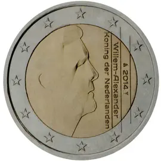

# Netherlands € 2.00

## Images

## Metadata

**Country:** [Netherlands](../index.md)\
**Serie:** [Netherlands 2014 - ...](index.md)\
**Monetary value:** € 2.00\
**Currency:** Euro

## Description

Profile picture of King Willem Alexander

## Mintages

| Year | Mintmark | Circulated | Brilliant Uncirculated | Proof |
| ---- | -------- | ---------- | ---------------------- | ----- |
| 2014 |          | 9059000    | 380564                 | 5000  |
| 2015 |          | 334000     | 196404                 | 7000  |
| 2016 |          | 0          | 141821                 | 5000  |
| 2017 |          | 0          | 77238                  | 8000  |
| 2018 |          | 0          | 21618                  | 3500  |
| 2019 |          | 0          | 24124                  | 3000  |
| 2020 |          | 0          | 38125                  | 3000  |
| 2021 |          | 0          | 33421                  | 3000  |
| 2022 |          | 0          | 22227                  | 3000  |
| 2023 |          | 0          | 37500                  | 3000  |
| 2024 |          | 0          | 12000                  | 0     |
| 2025 |          | 0          | 11500                  | 0     |
