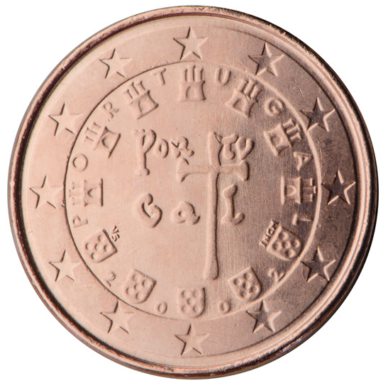

# Portugal € 0.01

## Images

## Metadata

**Country:** [Portugal](../index.md)\
**Serie:** [Portugal 2002 - ...](index.md)\
**Monetary value:** € 0.01\
**Currency:** Euro

## Description

## Mintages

| Year | Mintmark | Circulated | Brilliant Uncirculated | Proof |
| ---- | -------- | ---------- | ---------------------- | ----- |
| 2002 |          | 279161172  | 55000                  | 15000 |
| 2003 |          | 55000      | 55000                  | 15000 |
| 2004 |          | 75070000   | 60000                  | 15000 |
| 2005 |          | 40060000   | 60000                  | 10000 |
| 2006 |          | 30026500   | 26500                  | 3000  |
| 2007 |          | 105021500  | 21500                  | 2500  |
| 2008 |          | 75026500   | 26500                  | 3500  |
| 2009 |          | 60034000   | 34000                  | 4000  |
| 2010 |          | 15039500   | 39500                  | 4500  |
| 2011 |          | 20039500   | 39500                  | 4500  |
| 2012 |          | 50039500   | 39500                  | 4500  |
| 2013 |          | 39500      | 39500                  | 4500  |
| 2014 |          | 20021000   | 21000                  | 1500  |
| 2015 |          | 40023500   | 23500                  | 1500  |
| 2016 |          | 40028000   | 28000                  | 1500  |
| 2017 |          | 55021500   | 21500                  | 1500  |
| 2018 |          | 21500      | 21500                  | 1500  |
| 2019 |          | 50021500   | 21500                  | 1500  |
| 2020 |          | 14000      | 14000                  | 1500  |
| 2021 |          | 0          | 0                      | 0     |
| 2022 |          | 0          | 0                      | 0     |
| 2023 |          | 0          | 0                      | 0     |
| 2024 |          | 0          | 0                      | 0     |
