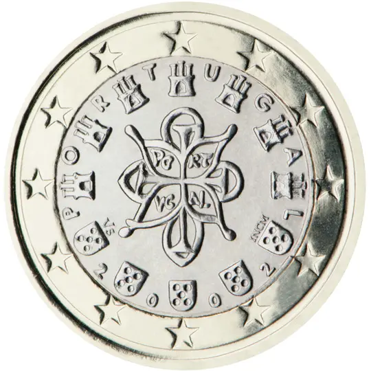

# Portugal € 1.00

## Images

## Metadata

**Country:** [Portugal](../index.md)\
**Serie:** [Portugal 2002 - ...](index.md)\
**Monetary value:** € 1.00\
**Currency:** Euro\
**Designer:** Vitor Manuel Fernandes dos Santos

## Description

Royal seal of 1144

| Year | Mintmark | Circulated | Brilliant Uncirculated | Proof |
| ---- | -------- | ---------- | ---------------------- | ----- |
| 2002 |          | 100228000  | 55000                  | 15000 |
| 2003 |          | 16206000   | 55000                  | 15000 |
| 2004 |          | 20000000   | 70000                  | 15000 |
| 2005 |          | 20000000   | 60000                  | 10000 |
| 2006 |          | 20000000   | 26500                  | 3000  |
| 2007 |          | 4935000    | 21500                  | 2500  |
| 2008 |          | 5107000    | 26500                  | 3500  |
| 2009 |          | 20000000   | 34000                  | 4000  |
| 2010 |          | 20000000   | 39500                  | 4500  |
| 2011 |          | 5000000    | 39500                  | 4500  |
| 2012 |          | 0          | 39500                  | 4500  |
| 2013 |          | 0          | 39500                  | 4500  |
| 2014 |          | 9000000    | 21000                  | 1500  |
| 2015 |          | 15000000   | 23500                  | 1500  |
| 2016 |          | 35000000   | 28000                  | 1500  |
| 2017 |          | 20000000   | 21500                  | 1500  |
| 2018 |          | 25000000   | 21500                  | 1500  |
| 2019 |          | 4000000    | 19000                  | 1500  |
| 2020 |          | 30000000   | 19000                  | 1500  |
| 2021 |          | 0          | 14000                  | 1500  |
| 2022 |          | 0          | 18500                  | 1500  |
| 2023 |          | 0          | 23500                  | 1500  |
| 2024 |          | 0          | 6000                   | 3700  |
| 2025 |          | 0          | 0                      | 0     |
| 2026 |          | 0          | 0                      | 0     |
