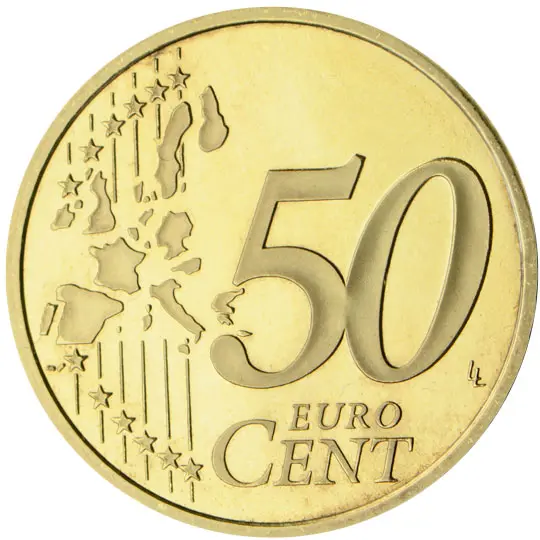

# San Marino € 0.50

## Images

## Metadata

**Country:** [San Marino](../index.md)\
**Serie:** [San Marino 2002 - 2017](index.md)\
**Monetary value:** € 0.50\
**Currency:** Euro\
**Designer:** Ettore Lorenzo Frapiccini, M. Frantisek Chochola

## Description

Fortress Towers "Il Montale", "Cesta" and "La Guaita"

## Mintages

| Year | Mintmark | Circulated | Brilliant Uncirculated | Proof |
| ---- | -------- | ---------- | ---------------------- | ----- |
| 2002 |          | 230000     | 160000                 | 0     |
| 2003 |          | 415000     | 210000                 | 0     |
| 2004 |          | 0          | 250000                 | 0     |
| 2005 |          | 249000     | 210000                 | 0     |
| 2006 |          | 413000     | 350000                 | 0     |
| 2007 |          | 390000     | 220000                 | 0     |
| 2008 |          | 1413000    | 50000                  | 13000 |
| 2009 |          | 0          | 50000                  | 13000 |
| 2010 |          | 0          | 178000                 | 8600  |
| 2011 |          | 0          | 78000                  | 8000  |
| 2012 |          | 124000     | 79000                  | 5000  |
| 2013 |          | 0          | 50000                  | 5000  |
| 2014 |          | 762000     | 35000                  | 4000  |
| 2015 |          | 784000     | 32000                  | 2400  |
| 2016 |          | 0          | 28000                  | 2400  |
