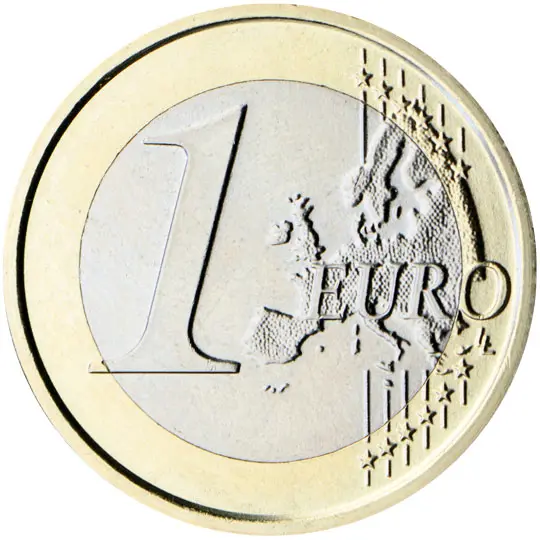

# San Marino € 1.00

## Images

## Metadata

**Country:** [San Marino](../index.md)\
**Serie:** [San Marino 2017 - ...](index.md)\
**Monetary value:** € 1.00\
**Currency:** Euro

## Description

The Second Tower features

## Mintages

| Year | Mintmark | Circulated | Brilliant Uncirculated | Proof |
| ---- | -------- | ---------- | ---------------------- | ----- |
| 2017 |          | 538000     | 36000                  | 2600  |
| 2018 |          | 1277000    | 25000                  | 2600  |
| 2019 |          | 540000     | 23000                  | 2500  |
| 2020 |          | 0          | 22000                  | 2500  |
| 2021 |          | 0          | 0                      | 0     |
| 2022 |          | 770000     | 9000                   | 0     |
| 2023 |          | 720000     | 54000                  | 0     |
| 2024 |          | 600000     | 0                      | 0     |
| 2025 |          | 0          | 0                      | 0     |
