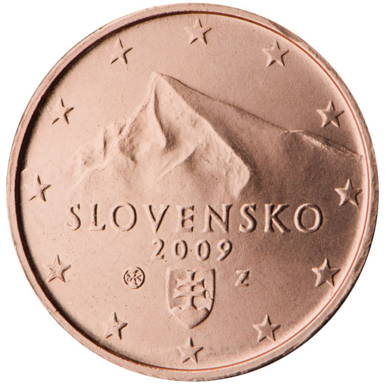

# Slovakia € 0.02

## Images

## Metadata

**Country:** [Slovakia](../index.md)\
**Serie:** [Slovakia 2009 - ...](index.md)\
**Monetary value:** € 0.02\
**Currency:** Euro

## Description

## Mintages

| Year | Mintmark | Circulated | Brilliant Uncirculated | Proof |
| ---- | -------- | ---------- | ---------------------- | ----- |
| 2009 |          | 80905325   | 123000                 | 13000 |
| 2010 |          | 50070000   | 65000                  | 5000  |
| 2011 |          | 15055000   | 49000                  | 6000  |
| 2012 |          | 45000      | 39000                  | 6000  |
| 2013 |          | 28000      | 20000                  | 5000  |
| 2014 |          | 5025000    | 21500                  | 3500  |
| 2015 |          | 12564000   | 21500                  | 3500  |
| 2016 |          | 17026000   | 24000                  | 3000  |
| 2017 |          | 13668000   | 15000                  | 3000  |
| 2018 |          | 12120000   | 15000                  | 2300  |
| 2019 |          | 14015000   | 13000                  | 2100  |
| 2020 |          | 25025000   | 40500                  | 1700  |
| 2021 |          | 0          | 0                      | 0     |
| 2022 |          | 0          | 0                      | 0     |
| 2023 |          | 0          | 0                      | 0     |
| 2024 |          | 0          | 0                      | 0     |
