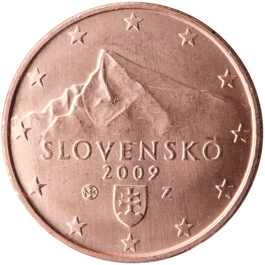

# Slovakia € 0.05

## Images

## Metadata

**Country:** [Slovakia](../index.md)\
**Serie:** [Slovakia 2009 - ...](index.md)\
**Monetary value:** € 0.05\
**Currency:** Euro

## Description

Kriváň Mountain in the High Tatras

## Mintages

| Year | Mintmark | Circulated | Brilliant Uncirculated | Proof |
| ---- | -------- | ---------- | ---------------------- | ----- |
| 2009 |          | 84957000   | 128000                 | 13000 |
| 2010 |          | 0          | 48000                  | 5000  |
| 2011 |          | 0          | 52000                  | 6000  |
| 2012 |          | 0          | 33000                  | 6500  |
| 2013 |          | 0          | 20000                  | 5000  |
| 2014 |          | 0          | 21500                  | 3500  |
| 2015 |          | 0          | 21500                  | 3300  |
| 2016 |          | 0          | 23000                  | 3000  |
| 2017 |          | 6138000    | 15000                  | 2500  |
| 2018 |          | 8026000    | 18000                  | 2300  |
| 2019 |          | 4015000    | 18000                  | 2000  |
| 2020 |          | 16025000   | 22700                  | 2700  |
| 2021 |          | 6019000    | 17000                  | 1900  |
| 2022 |          | 10000000   | 11000                  | 1900  |
| 2023 |          | 3000000    | 0                      | 1400  |
| 2024 |          | 7000000    | 15000                  | 0     |
| 2025 |          | 0          | 0                      | 0     |
