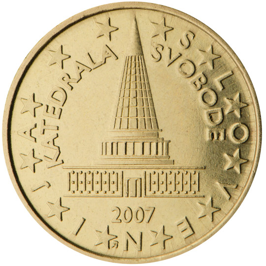

# Slovenia € 0.10

## Images

## Metadata

**Country:** [Slovenia](../index.md)\
**Serie:** [Slovenia 2007 - ...](index.md)\
**Monetary value:** € 0.10\
**Currency:** Euro

## Description

## Mintages

| Year | Mintmark | Circulated | Brilliant Uncirculated | Proof |
| ---- | -------- | ---------- | ---------------------- | ----- |
| 2007 |          | 42700000   | 100000                 |       |
| 2008 |          | 0          | 148000                 | 2000  |
| 2009 |          | 0          | 100000                 |       |
| 2010 |          | 0          | 70000                  | 5000  |
| 2011 |          | 0          | 15000                  | 2000  |
| 2012 |          | 0          | 15000                  | 2000  |
| 2013 |          | 0          | 15000                  | 2000  |
| 2014 |          | 0          | 15000                  | 1500  |
| 2015 |          | 0          | 13500                  | 1500  |
| 2016 |          | 0          | 10500                  | 1500  |
| 2017 |          | 0          | 8000                   | 1500  |
| 2018 |          | 3000000    | 8000                   | 750   |
| 2019 |          | 22000000   | 8000                   | 750   |
| 2020 |          | 0          | 0                      |       |
| 2021 |          | 0          | 0                      | 0     |
| 2022 |          | 0          | 0                      | 0     |
| 2023 |          | 0          | 0                      | 0     |
| 2024 |          | 0          | 0                      | 0     |
