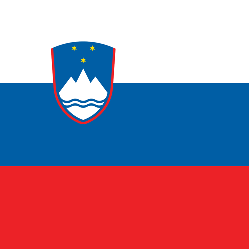

# Slovenia

## Metadata

**Isocode:** SI

## Description

Slovenia is a country in central Europe on the southern edge of the Alps. The country is densely wooded and mountainous. Slovenia joined the euro area in 2007.

## Images

