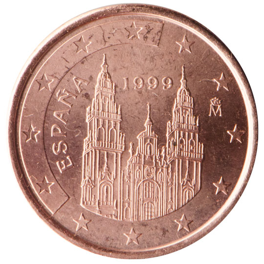

# Spain € 0.01

## Images

## Metadata

**Country:** [Spain](../index.md)\
**Serie:** [Spain 1999 - 2010](index.md)\
**Monetary value:** € 0.01\
**Currency:** Euro

## Description

## Mintages

| Year | Mintmark | Circulated | Brilliant Uncirculated | Proof |
| ---- | -------- | ---------- | ---------------------- | ----- |
| 1999 |          | 716500000  | 49000                  | 0     |
| 2000 |          | 70500000   | 49000                  | 0     |
| 2001 |          | 106100000  | 49000                  | 0     |
| 2002 |          | 180600000  | 99000                  | 23000 |
| 2003 |          | 390700000  | 164000                 | 8000  |
| 2004 |          | 206700000  | 43000                  | 0     |
| 2005 |          | 444200000  | 49000                  | 3000  |
| 2006 |          | 383900000  | 48000                  | 0     |
| 2007 |          | 384900000  | 39000                  | 1800  |
| 2008 |          | 374700000  | 39500                  | 2000  |
| 2009 |          | 131500000  | 70000                  | 2500  |
| 2010 |          | 227400000  | 66500                  | 3000  |
| 2011 |          | 339300000  | 59300                  | 0     |
| 2012 |          | 400600000  | 26000                  | 2300  |
| 2013 |          | 297500000  | 54000                  | 1300  |
| 2014 |          | 65000000   | 54000                  | 1400  |
