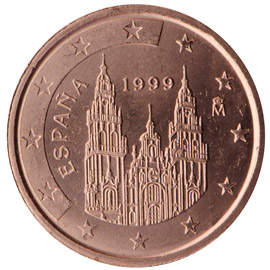

# Spain € 0.02

## Images

## Metadata

**Country:** [Spain](../index.md)\
**Serie:** [Spain 1999 - 2010](index.md)\
**Monetary value:** € 0.02\
**Currency:** Euro\
**Designer:** Garcilaso Rollán Sánchez

## Description

Cathedral of Santiago de Compostela

## Mintages

| Year | Mintmark | Circulated | Brilliant Uncirculated | Proof |
| ---- | -------- | ---------- | ---------------------- | ----- |
| 1999 |          | 114700000  | 49000                  | 0     |
| 2000 |          | 819300000  | 49000                  | 0     |
| 2001 |          | 528000000  | 49000                  | 0     |
| 2002 |          | 7000000    | 99000                  | 23000 |
| 2003 |          | 5800000    | 164000                 | 8000  |
| 2004 |          | 206600000  | 43000                  | 0     |
| 2005 |          | 275100000  | 49000                  | 3000  |
| 2006 |          | 262000000  | 48000                  | 0     |
| 2007 |          | 185500000  | 39000                  | 1800  |
| 2008 |          | 192400000  | 39500                  | 2000  |
| 2009 |          | 169100000  | 70000                  | 2500  |
| 2010 |          | 153200000  | 66500                  | 3000  |
| 2011 |          | 96600000   | 59300                  | 0     |
| 2012 |          | 99600000   | 26000                  | 2300  |
| 2013 |          | 200600000  | 54000                  | 1300  |
| 2014 |          | 19400000   | 54000                  | 1400  |
