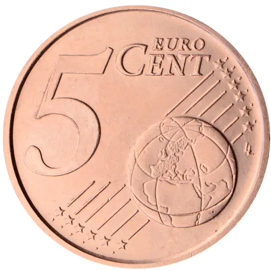
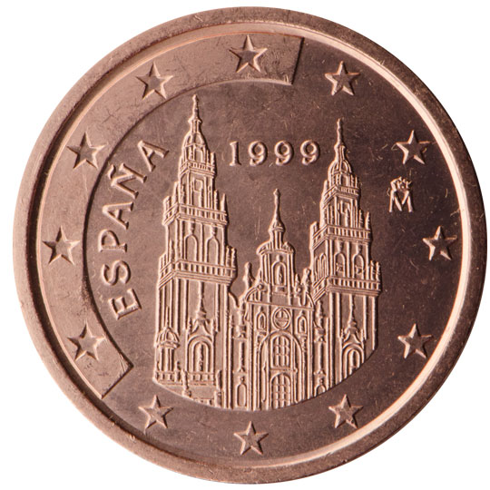

# Spain € 0.05

## Images

## Metadata

**Country:** [Spain](../index.md)\
**Serie:** [Spain 1999 - 2010](index.md)\
**Monetary value:** € 0.05\
**Currency:** Euro

## Description

## Mintages

| Year | Mintmark | Circulated | Brilliant Uncirculated | Proof |
| ---- | -------- | ---------- | ---------------------- | ----- |
| 1999 |  | 0| 49030 |  |
| 2000 |  | 0| 49600 |  |
| 2001 |  | 0| 49426 |  |
| 2002 |  | 0| 99301 | 23000 |
| 2003 |  | 0| 149306 | 8904 |
| 2004 |  | 0| 43000 |  |
| 2005 |  | 0| 49923 | 3000 |
| 2006 |  | 0| 49996 |  |
| 2007 |  | 0| 39766 | 1800 |
| 2008 |  | 0| 39560 | 2000 |
| 2009 |  | 0| 70000 | 2500 |
| 2010 |  | 0| 65000 | 3000 |
| 2011 |  | 0| 55000 | 1800 |
| 2012 |  | 0| 53500 | 2300 |
| 2013 |  | 0| 51500 | 1200 |
| 2014 |  | 0| 52000 | 1463 |
