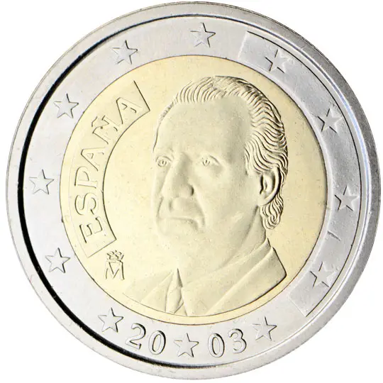

# Spain € 2.00

## Images

## Metadata

**Country:** [Spain](../index.md)\
**Serie:** [Spain 1999 - 2010](index.md)\
**Monetary value:** € 2.00\
**Currency:** Euro

## Description

King Juan Carlos I

## Mintages

| Year | Mintmark | Circulated | Brilliant Uncirculated | Proof |
| ---- | -------- | ---------- | ---------------------- | ----- |
| 1999 |          | 0          | 49000                  | 0     |
| 2000 |          | 65100000   | 49000                  | 0     |
| 2001 |          | 151700000  | 49000                  | 0     |
| 2002 |          | 175500000  | 99000                  | 23000 |
| 2003 |          | 53500000   | 164000                 | 8000  |
| 2004 |          | 4100000    | 43000                  | 0     |
| 2005 |          | 4000000    | 49000                  | 3000  |
| 2006 |          | 4000000    | 48000                  | 0     |
| 2007 |          | 4000000    | 39000                  | 1800  |
| 2008 |          | 19500000   | 39500                  | 2000  |
| 2009 |          | 17500000   | 70000                  | 2500  |
| 2010 |          | 4000000    | 66500                  | 3000  |
| 2011 |          | 4000000    | 59300                  | 0     |
| 2012 |          | 4000000    | 26000                  | 2300  |
| 2013 |          | 4000000    | 54000                  | 1300  |
| 2014 |          | 3600000    | 54000                  | 1400  |
