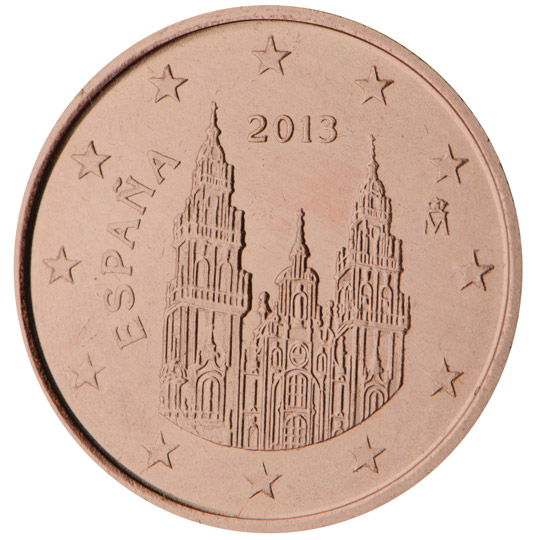

# Spain € 0.01

## Images

## Metadata

**Country:** [Spain](../index.md)\
**Serie:** [Spain 2015 - ...](index.md)\
**Monetary value:** € 0.01\
**Currency:** Euro\
**Designer:** Garcilaso Rollán Sánchez

## Description

Cathedral of Santiago de Compostela

## Mintages

| Year | Mintmark | Circulated | Brilliant Uncirculated | Proof |
| ---- | -------- | ---------- | ---------------------- | ----- |
| 2015 |          | 476800000  | 61500                  | 1700  |
| 2016 |          | 437900000  | 72600                  | 0     |
| 2017 |          | 519600000  | 10300                  | 1000  |
| 2018 |          | 317900000  | 14000                  | 1200  |
| 2019 |          | 309800000  | 17000                  | 1500  |
| 2020 |          | 0          | 10500                  | 900   |
| 2021 |          | 0          | 7000                   | 800   |
| 2022 |          | 0          | 12000                  | 1500  |
| 2023 |          | 0          | 17000                  | 0     |
| 2024 |          | 0          | 0                      | 0     |
| 2025 |          | 0          | 0                      | 0     |
| 2026 |          | 0          | 0                      | 0     |
