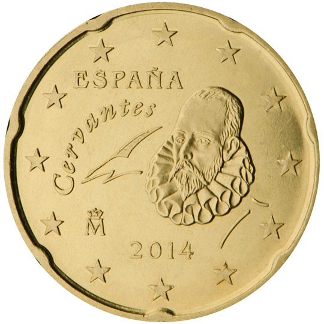

# Spain € 0.20

## Images

## Metadata

**Country:** [Spain](../index.md)\
**Serie:** [Spain 2015 - ...](index.md)\
**Monetary value:** € 0.20\
**Currency:** Euro

## Description

## Mintages

| Year | Mintmark | Circulated | Brilliant Uncirculated | Proof |
| ---- | -------- | ---------- | ---------------------- | ----- |
| 2015 |          | 4159225    | 59225                  | 1700  |
| 2016 |          | 79169648   | 69648                  | 1040  |
| 2017 |          | 112508300  | 8300                   | 1020  |
| 2018 |          | 119512600  | 12600                  | 1200  |
| 2019 |          | 130715000  | 15000                  | 1500  |
| 2020 |          | 0          | 0                      | 0     |
| 2021 |          | 0          | 0                      | 0     |
| 2022 |          | 0          | 0                      | 0     |
| 2023 |          | 0          | 0                      | 0     |
| 2024 |          | 0          | 0                      | 0     |
