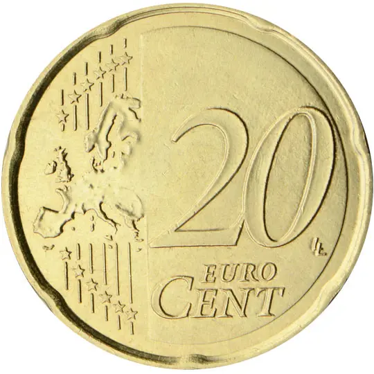
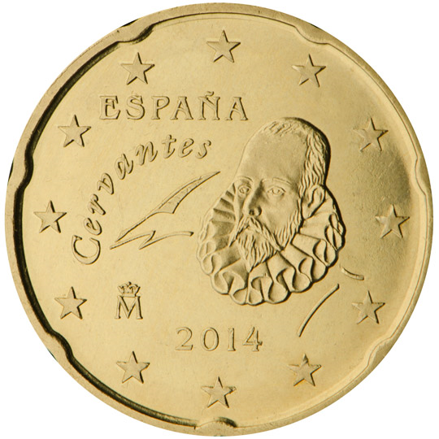

# Spain € 0.20

## Images

## Metadata

**Country:** [Spain](../index.md)\
**Serie:** [Spain 2015 - ...](index.md)\
**Monetary value:** € 0.20\
**Currency:** Euro\
**Designer:** Begoña Castellanos Garcia

## Description

Miguel de Cervantes

## Mintages

| Year | Mintmark | Circulated | Brilliant Uncirculated | Proof |
| ---- | -------- | ---------- | ---------------------- | ----- |
| 2015 |          | 4100000    | 61500                  | 1700  |
| 2016 |          | 79100000   | 72600                  | 0     |
| 2017 |          | 112500000  | 10300                  | 1000  |
| 2018 |          | 119500000  | 14000                  | 1200  |
| 2019 |          | 137000000  | 17000                  | 1500  |
| 2020 |          | 52100000   | 10500                  | 900   |
| 2021 |          | 26100000   | 7000                   | 800   |
| 2022 |          | 17500000   | 12000                  | 1500  |
| 2023 |          | 60800000   | 17000                  | 0     |
| 2024 |          | 74000000   | 10000                  | 1500  |
| 2025 |          | 0          | 10000                  | 1500  |
| 2026 |          | 0          | 0                      | 0     |
