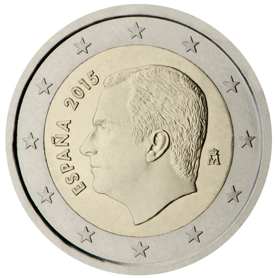

# Spain € 2.00

## Images

## Metadata

**Country:** [Spain](../index.md)\
**Serie:** [Spain 2015 - ...](index.md)\
**Monetary value:** € 2.00\
**Currency:** Euro

## Description

## Mintages

| Year | Mintmark | Circulated | Brilliant Uncirculated | Proof |
| ---- | -------- | ---------- | ---------------------- | ----- |
| 2015 |  | 0| 59225 | 1700 |
| 2016 |  | 0| 69648 | 1040 |
| 2017 |  | 0| 8300 | 1020 |
| 2018 |  | 0| 12600 | 1200 |
| 2019 |  | 0| 15000 | 1500 |
| 2020 |  | 0| 0 | 0 |
