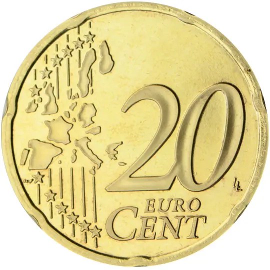

# Vatican City € 0.20

## Images

## Metadata

**Country:** [Vatican City](../index.md)\
**Serie:** [Vatican City 2005](index.md)\
**Monetary value:** € 0.20\
**Currency:** Euro\
**Designer:** Daniela Longo

## Description

Coat of arms of the Cardinal Chamberlain and the Apostolic Chamber

## Mintages

| Year | Mintmark | Circulated | Brilliant Uncirculated | Proof |
| ---- | -------- | ---------- | ---------------------- | ----- |
| 2005 |          | 0          | 60000                  | 0     |
