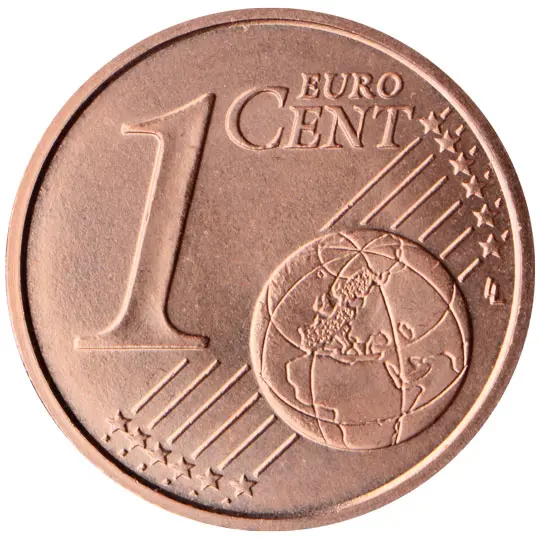

# Vatican City € 0.01

## Images

## Metadata

**Country:** [Vatican City](../index.md)\
**Serie:** [Vatican City 2026 - ...](index.md)\
**Monetary value:** € 0.01\
**Currency:** Euro\
**Designer:** Daniela Longo

## Description

Papal Coat of arms

## Mintages

| Year | Mintmark | Circulated | Brilliant Uncirculated | Proof |
| ---- | -------- | ---------- | ---------------------- | ----- |
| 2026 |          | 0          | 0                      | 0     |

### Sources

- [Designer](https://www.vaticanstate.va/en/news/4413-a-new-visual-language-for-the-vatican-coin-set-between-colour-and-design.html)
